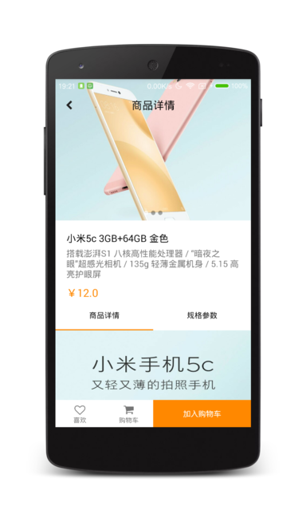
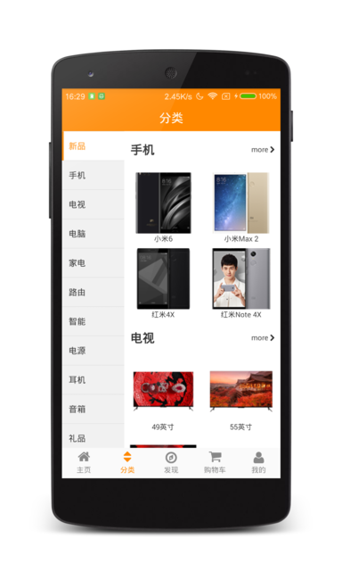
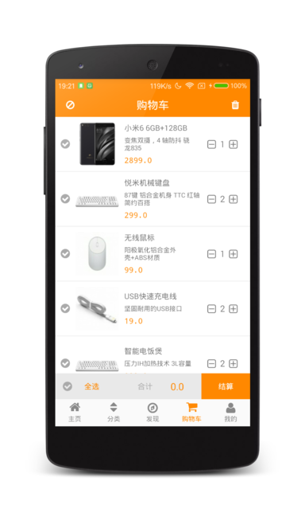
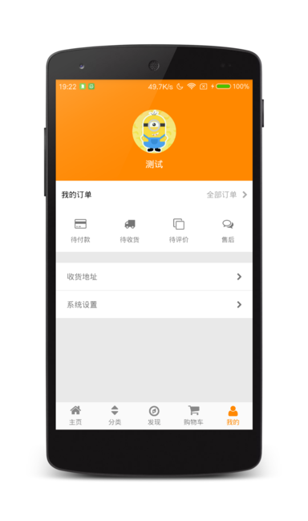

## EC APP ##
<div align="center">
	
</div>

## APP APK ##
[](https://www.pgyer.com/nIfz)

## APP PICS ##
|首页|商品详情|分类|
|:-:|:-:|:-:|
||||

|发现|购物车|我的|
|:-:|:-:|:-:|
||||

## Highlights ##
* 项目进行模块化拆分，分为：核心组件、电商组件、UI组件。
* 单Activity设计。
* Retrofit2+RxJava2网络框架。
* Glide4图片加载库。
* GreenDao数据库。
* ZBar二维码扫描。
* JPush极光推送。
* ShareSDK多平台分享。
* 发现页面混合开发，WebView封装。
* MD风格商品详情页面。

## License ##
``````
Copyright 2017 tzizi5566

Licensed under the Apache License, Version 2.0 (the "License");
you may not use this file except in compliance with the License.
You may obtain a copy of the License at

   http://www.apache.org/licenses/LICENSE-2.0

Unless required by applicable law or agreed to in writing, software
distributed under the License is distributed on an "AS IS" BASIS,
WITHOUT WARRANTIES OR CONDITIONS OF ANY KIND, either express or implied.
See the License for the specific language governing permissions and
limitations under the License.
``````
